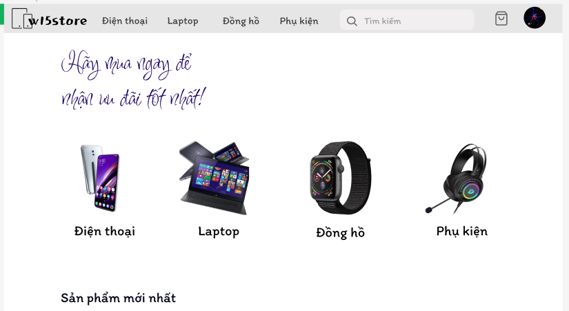
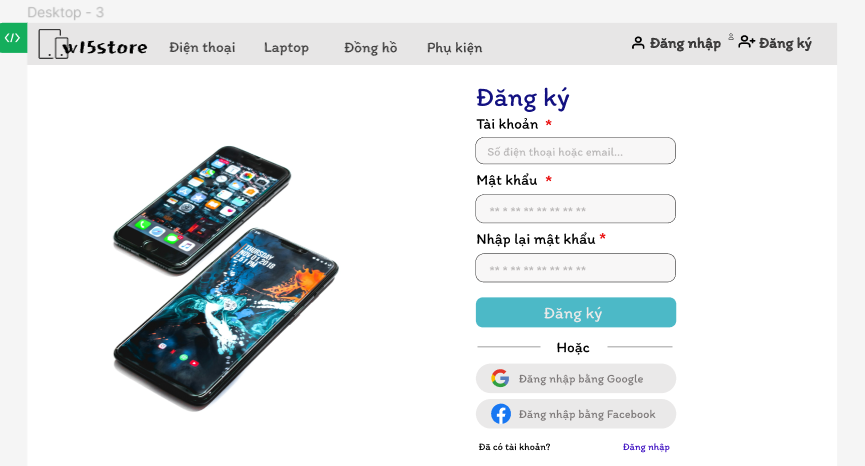
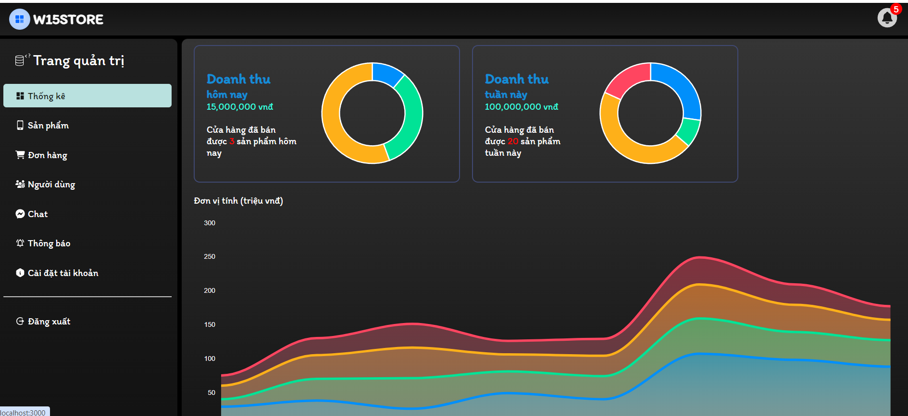
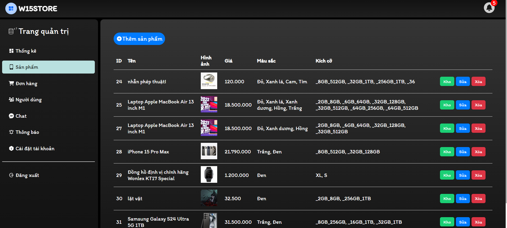
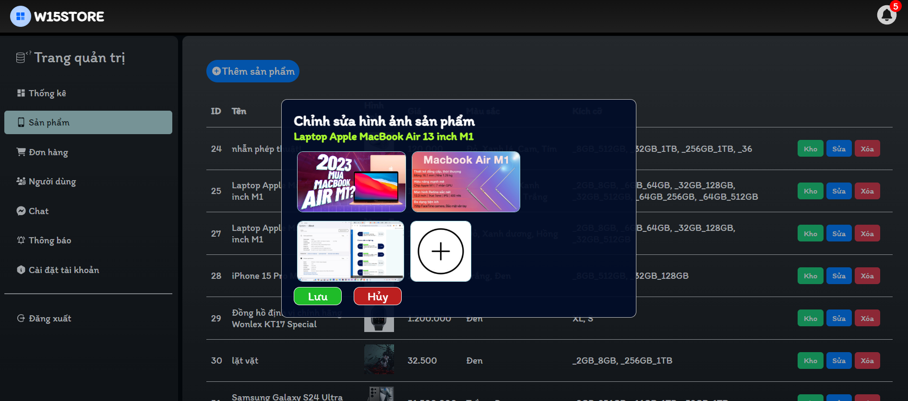
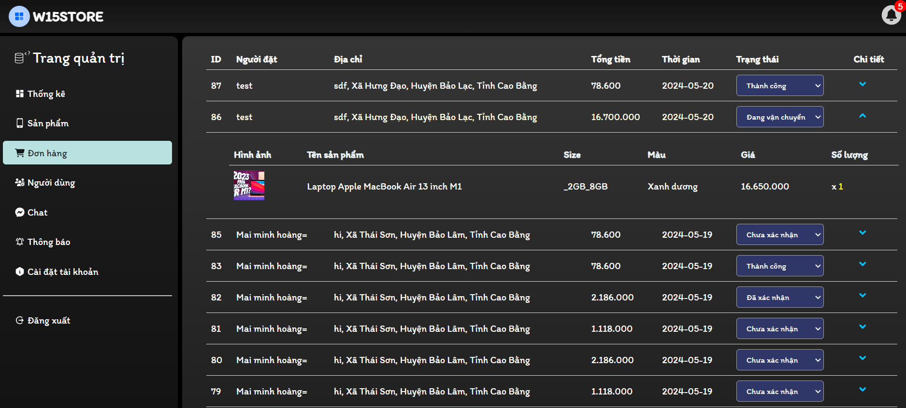
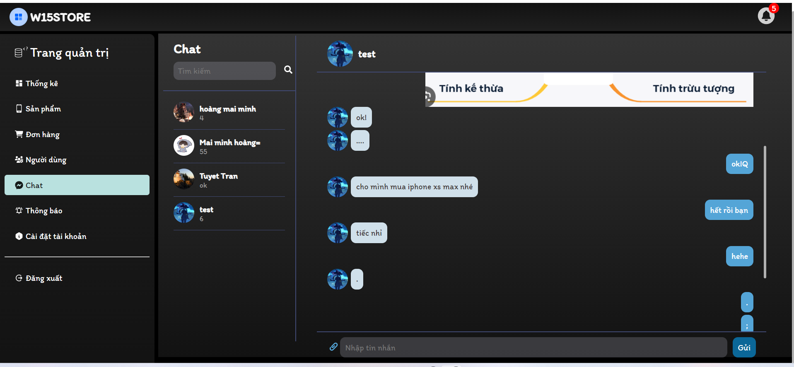

# Website Bán Điện Thoại, Laptop, Đồng Hồ và Phụ Kiện Điện Tử

Chào mừng bạn đến với dự án website bán điện thoại, laptop, đồng hồ và phụ kiện điện tử! Dự án này được xây dựng nhằm cung cấp một nền tảng mua sắm trực tuyến hiện đại và tiện lợi, sử dụng Spring Boot cho backend và ReactJS cho frontend.

## Tính Năng

- **Quản lý sản phẩm**: Xem, thêm, sửa và xóa các sản phẩm bao gồm điện thoại, laptop, đồng hồ và phụ kiện điện tử.
- **Tìm kiếm và phân loại**: Tìm kiếm sản phẩm theo tên, thể loại, thương hiệu và giá cả.
- **Giỏ hàng**: Thêm sản phẩm vào giỏ hàng, cập nhật số lượng và xóa sản phẩm khỏi giỏ hàng.
- **Thanh toán**: Thực hiện thanh toán đơn hàng qua các phương thức thanh toán trực tuyến.
- **Quản lý đơn hàng**: Xem lịch sử đơn hàng, chi tiết đơn hàng và trạng thái đơn hàng.
- **Đăng nhập/Đăng ký**: Người dùng có thể tạo tài khoản mới hoặc đăng nhập để sử dụng các tính năng của ứng dụng.
 
- **Đánh giá và bình luận**: Người dùng có thể để lại đánh giá và bình luận cho sản phẩm.
- **Nhắn tin và thông báo thời gian thực**
- **Và một số chức năng cho admin**

## Công Nghệ Sử Dụng

### Backend

- **Spring Boot**: Framework mạnh mẽ giúp xây dựng các dịch vụ web.
- **Hibernate**: ORM để quản lý cơ sở dữ liệu.
- **SQLServer**: Hệ quản trị cơ sở dữ liệu quan hệ để lưu trữ thông tin sản phẩm, người dùng và đơn hàng...
- **Spring Security**: Bảo mật ứng dụng web, quản lý xác thực và phân quyền người dùng.
- **Và 1 số dependency khác**
### Frontend

- **ReactJS**: Thư viện JavaScript xây dựng giao diện người dùng.
- **Axios**: Thư viện để gọi API.
- **SockJs**: Thư viện giúp kết nối socket.
- **Và rất nhiều thư viện liên quan khác**

